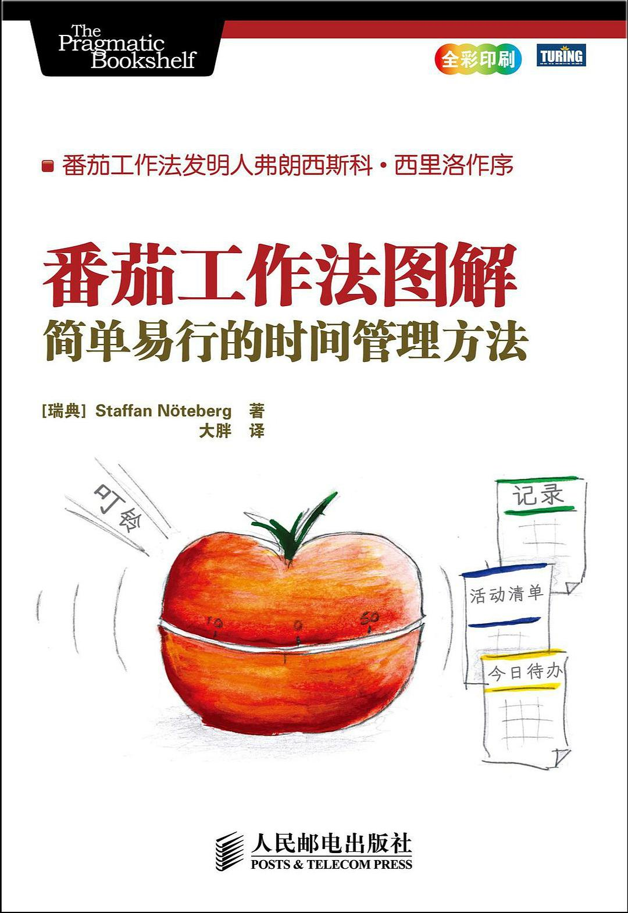

# 时间管理项目
## 介绍
### 开发理念
结合 （单位时间内专注的干一件事） 和 （确定目标|方向 -> 行动 -> 记录 -> 即时反馈 -> 复盘 -> 优化提升） 两大理念 以及 番茄todo app  进行开发的项目, 专注于记录与提升。

### 项目介绍
<video width="600" controls>
  <source src="src/assets/项目介绍.mp4" type="video/mp4">
  Your browser does not support the video tag.
</video>

1. 集合了番茄todo app大部分功能（记录与展示 扩展了markdown文档的查看方式）。
2. everything in one理念(简便的记录, 多样的查看, 包括echart图表展示, markdown查看与编辑)
3. 后续功能扩展: 多端适配、多端同步、奖励系统、购物记录、想干的事、想要的东西...

### 技术栈
1. vue全家桶（路由、pinia + 本地浏览器存储【localStorage + indexdb】 + hook
2. echart 图表展示（饼状图、折线图【范围选取】、条形图）
3. 扩展：v-md-editor（md文档的编辑与展示）、pdf.js、idb.js（indexed数据库操作）
